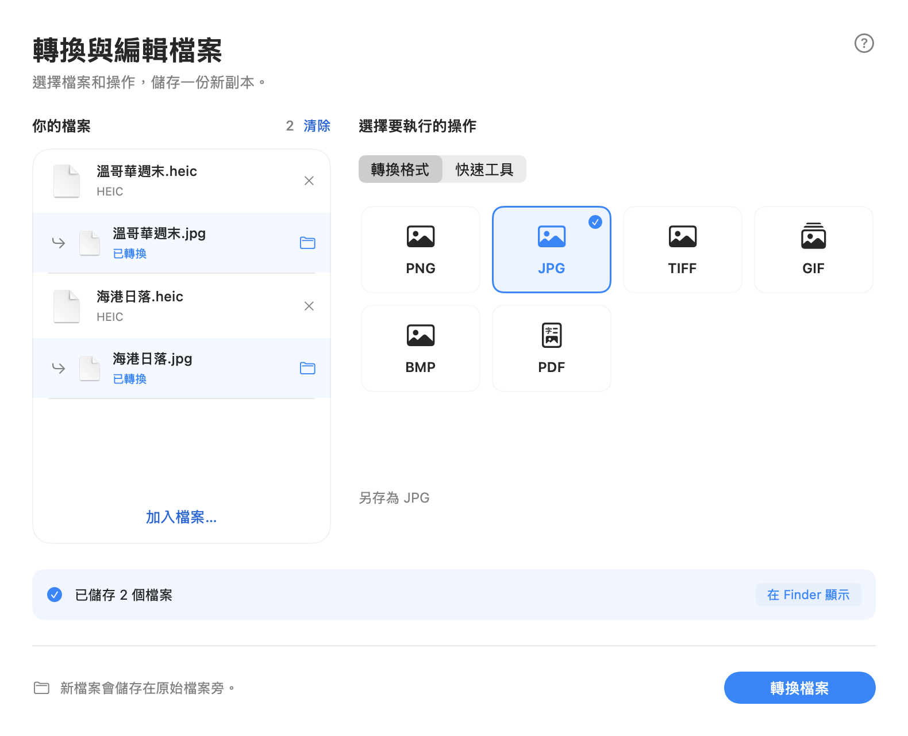
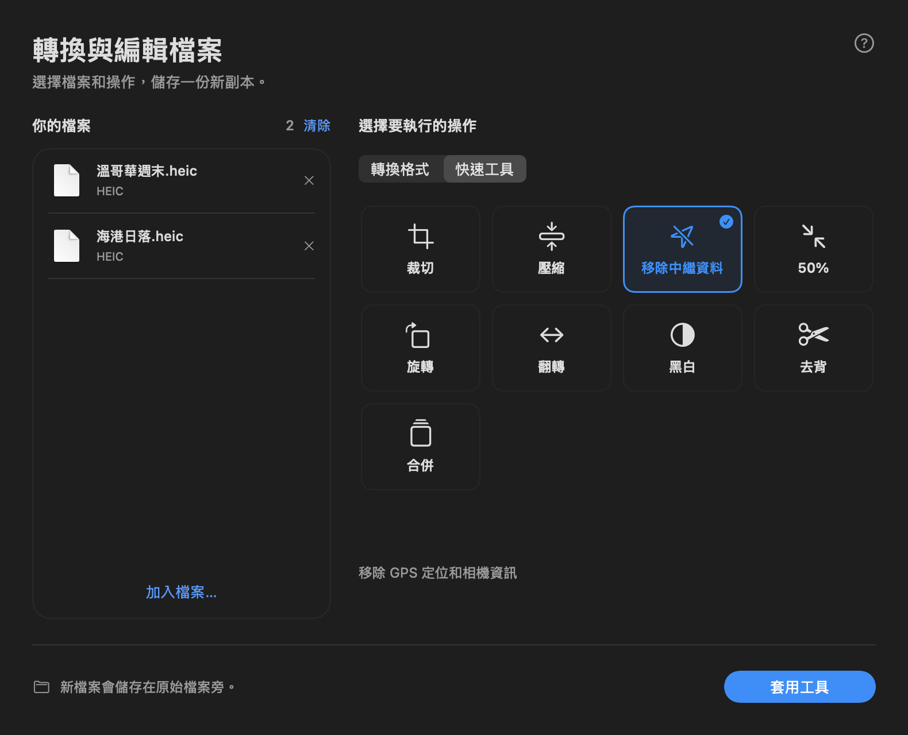

# Local fork 1.6.1

Based on upstream `v1.5.0` (`3ecf3fe0aa5e5c0d383db899bf77986952d4fe19`).
This is an independent local build, not an upstream release or an Apple-notarized app.
It uses the bundle identifier `com.a2289866844.fileflipper` so existing upstream folder grants are not reused.

## Results in 1.6.1

- Converted copies appear immediately below their own source in the workspace,
  with a converted label and individual **Show in Finder** button.
- Explicit source references preserve the association through partial failures,
  repeated conversions, same-name inputs in different directories and merged outputs.
- Files continue to save beside their originals. Existing names receive a numeric
  suffix; the app does not control Finder's visual sort order.
- HEIC, TIFF and BMP choices include short explanations.



## Interface in 1.6.0

- Open the app to a native workspace: choose or drop files, select a format or tool,
  then run the action. Results include a **Show in Finder** button.
- Use Shift while dragging in Finder for a compact format grid, or Option–Shift
  for quick tools. Only dropping within a visible tile triggers an action.
- Use automatic light/dark appearance, system type, blue selection states and
  Traditional Chinese localization. The crop window and progress HUD share the theme.
- Reject mixed file kinds as a batch instead of silently ignoring some files.
  Prevent duplicate actions and changes to inputs while processing.
- Request only a chosen output folder, with clear cancellation and error messages.
  This update does not add entitlements or enable login startup.

### Screenshots

These are renders of the actual views using synthetic selections, not screenshots of personal files.





## Input hardening retained from 1.5.1

- Validate ZIP end records, full central/local headers, names, payload boundaries,
  duplicate entries and overlapping local records before reading entry data.
- Bound archive reads to 256 MiB, individual entries to 64 MiB, declared total
  uncompressed size to 256 MiB and entry count to 10,000. ZIP64, encryption and
  multi-disk archives are unsupported. Oversized or malformed packages are rejected.
- Use the macOS system zlib decoder. Require complete deflate streams, exact
  decompressed lengths and CRC32 matches before accepting entry contents.
- Reject XML DTDs/entities, external resources and unsupported encodings. Limit
  XML parts to 16 MiB, nesting to 128 and elements plus attributes to 250,000.
  Ordinary UTF-8 and UTF-16 Office XML remains supported.
- Bound Excel coordinates to the format's limits and rendered tables to 500,000
  cells per workbook. Keep non-finite numbers as text and bound number formatting.
- Clamp Word and PowerPoint indentation to the nine supported list levels.
- Keep App Sandbox and hardened runtime; explicitly disable `get-task-allow`
  and Xcode's injected base entitlements. No network entitlement is added.
- Require Xcode for app builds; remove the fallback that built an unsandboxed app.
  The install script refuses to overwrite an existing application.

## Build and test

Requires Xcode and macOS 14 or later. No third-party runtime package is required.

```sh
swift test
FILEFLIPPER_BUILD_DIR=/tmp/fileflipper-build ./scripts/build-app.sh
```

The application is produced at:

```text
/tmp/fileflipper-build/DerivedData/Build/Products/Release/FileFlipper.app
```

The script verifies code-signature integrity and sandbox/debugger entitlements.
Local signing is ad-hoc; it does not establish an Apple Developer ID or notarization.
Do not change Gatekeeper settings or strip quarantine attributes to distribute this build.

The 34 tests cover malformed and truncated ZIPs, decompression limits, corrupt
checksums, XML limits, unusual Office indices, DOCX/XLSX/PPTX-to-Markdown examples,
and PNG-to-JPEG conversion. They verify that input files and existing outputs remain
unchanged. Workspace tests cover selection, mixed batches, duplicate-run protection,
unsupported files and precise quick-picker hit areas. An opt-in rendering test generates
14 Traditional Chinese workspace states and two quick palettes, using AppKit hosting views.
Fixtures and file names are synthetic; no personal files are used.

```sh
FILEFLIPPER_PREVIEW_DIR=/tmp/fileflipper-ui-previews swift test
```

Without the preview environment variable, the rendering test is skipped.

## Scope

These changes address the identified input-handling and build-permission issues.
They are not a complete security audit or a guarantee against all malicious files.
System image, media and document importers still process input, and the app should
only receive access to folders needed for conversion. Very large Office documents
may exceed the intentional limits above.

To use the app, open FileFlipper and choose files in the workspace, or use Shift while
dragging in Finder. The menu-bar document icon can reopen the workspace. Grant access
only to the folder needed for converted copies when prompted.
