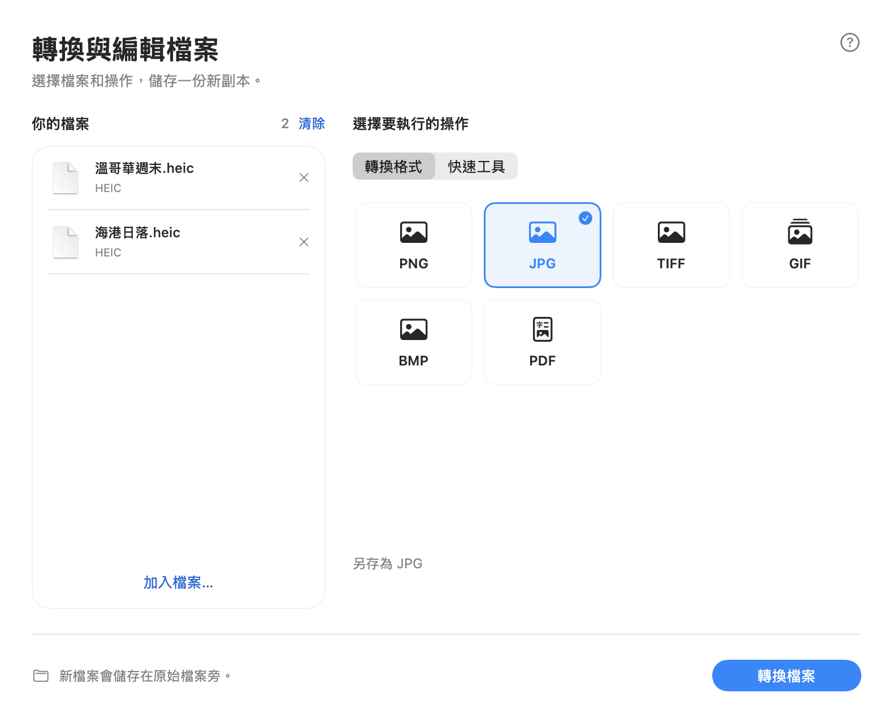

# FileFlipper — Quick Edit for Mac

> **Fork build 1.6.1:** native macOS workspace, a clearer Finder quick-action grid,
> automatic light/dark appearance and Traditional Chinese. Includes the 1.5.1 Office
> input hardening and sandboxed local build. See [fork changes and build instructions](FORK-NOTES.md).
> The upstream download links below still refer to upstream binaries, not this fork's changes.

## 此 fork 的新版介面

開啟 App → 拖入或選擇檔案 → 選格式或工具 → 轉換。完成後新檔會接在清單中的原檔下方，也可直接在 Finder 顯示結果。
保留 Finder 的 **Shift** 格式選單與 **Option + Shift** 快速工具，支援繁體中文與自動明暗模式。



以下保留上游說明與舊版截圖；目前 fork 的介面與建置方式請見 [FORK-NOTES.md](FORK-NOTES.md)。

---

**在 Finder 里直接转换文件格式，不用打开任何软件。一键转 Markdown，喂给 AI 更省 token。**
**A free, open-source file converter that works inside Finder. One-click Markdown for AI — fewer tokens.**

<p align="center">
  
  &nbsp;&nbsp;
  
</p>

<p align="center">
  
</p>

<p align="center">
  <a href="#中文说明">中文说明</a> ·
  <a href="#english">English</a> ·
  <a href="#for-developers--开发者">For developers / 开发者</a> ·
  <a href="#license--许可证">License / 许可证</a>
</p>

---

## 中文说明

### FileFlipper 是什么？

FileFlipper 是一个免费、开源的 Mac 小工具。装好之后，你**不需要打开它的窗口**，它安安静静待在屏幕右上角的菜单栏里。

想转换文件时，只要在 Finder（访达）里**拖动文件，同时按住 Shift 键**，鼠标上方就会弹出一排**带图标的圆形按钮**（「格式气泡」）（就像上面的图）。把文件拖到想要的格式上，松开鼠标——转换好的新文件就出现在原文件旁边了。

- 📸 照片 HEIC 转 JPG、PNG 转 PDF
- 📄 Word 转 PDF、PDF 转图片或文字
- ⭐ **所有文档一键转 Markdown**（喂给 AI 更省 token）；PPT、Excel 转 PDF
- 🎬 视频转 GIF、视频提取音频
- ✂️ 裁剪图片、🗜 压缩图片 / PDF / 视频、抠图去背景、合并多个 PDF ……

**所有处理都在你自己的 Mac 上完成，文件不会上传到任何地方，也不需要联网。**

### ⭐ 一键转 Markdown：喂给 AI 更省 token

把 Word、PDF、PPT、Excel 拖一下、按住 Shift，选 **MD**，几秒钟就得到一份干净的 Markdown 文件，可以直接粘贴给 ChatGPT、Claude、Gemini、DeepSeek、Kimi 等 AI。

- **更省 token**：Markdown 是纯文本，只用很少的符号（`#`、`-`、`|`）表示标题、列表和表格。和直接上传 PDF / Word、或者粘贴网页内容相比，通常占用更少的 token，同样的额度能塞进更多内容。
- **AI 读得更准**：标题层级、列表、表格结构都保留下来，AI 更容易理解文档结构，回答更准确。
- **扫描件也行**：没有文字层的扫描 PDF 会自动用苹果自带的 OCR 识别文字（支持中英文）。
- **全程离线**：转换在你的 Mac 上完成，文件不用先上传到任何转换网站，敏感文档更安全。

| 拖进来的文件 | 转成 Markdown 后保留 |
|---|---|
| Word（DOCX）、RTF、ODT、HTML | 标题、粗体、斜体、链接、列表、表格 |
| PDF（包括扫描件） | 每一页的文字 |
| PPT（PPTX） | 每页的标题和要点、表格 |
| Excel（XLSX） | 每张工作表变成一个 Markdown 表格 |

---

### 第一步：安装

需要 **macOS 14（Sonoma）或更新的系统**。（查看方法：点屏幕左上角的苹果标志  → 关于本机。）

#### 方法 A：从 App Store 安装（最简单，即将上架）

上架后在 Mac App Store 搜索 **FileFlipper**，点「获取」即可。上架后这里会放链接。

#### 方法 B：直接下载安装包

1. 点这里下载：**[FileFlipper.zip](https://github.com/Aimee51819/FileFlipper/releases/latest/download/FileFlipper.zip)**
2. 打开「下载」文件夹，双击 `FileFlipper.zip`，会得到一个 **FileFlipper** 应用。
3. 把 **FileFlipper** 拖进「应用程序」(Applications) 文件夹。
4. 双击打开它。**第一次打开时 Mac 会提示「无法验证开发者」或「Apple 无法检查其是否包含恶意软件」**，这是因为这个下载版没有经过苹果的付费签名，属于正常现象。按下面做就能打开：
   1. 在提示框里点「完成」或「好」（**不要**点「移到废纸篓」）。
   2. 打开「系统设置」→「隐私与安全性」，往下滚动。
   3. 看到「已阻止使用 FileFlipper」，点旁边的 **「仍要打开」**，输入开机密码确认。
   4. 再次双击 FileFlipper，在弹出的对话框里点「打开」。

   以后再打开就不会提示了。

#### 方法 C：自己编译（给会用终端的人）

见文末 [For developers / 开发者](#for-developers--开发者)。

---

### 第二步：第一次打开

1. 打开 FileFlipper 后，**不会出现任何大窗口**。请看屏幕**右上角的菜单栏**，会多出一个 **◎（圆圈）图标**，这就是 FileFlipper。
2. 第一次打开时会弹出一个使用说明，点 **「允许访问个人文件夹…」**（英文系统下是 Allow Home Folder…）。
3. 在弹出的文件选择窗口里，**直接点右下角的「授权」按钮**（英文系统下是 Grant Access）（默认选中的就是你的个人文件夹，一般是你的用户名，前面有个小房子图标 🏠）。

> **为什么要授权？** 苹果规定，App Store 里的软件不能随便在你的文件夹里新建文件。授权一次个人文件夹后，FileFlipper 就能把转换好的文件保存在原文件旁边，以后再也不会问你。
> 如果你跳过了这一步也没关系，第一次转换文件时它会再问一次。

---

### 第三步：开始使用

#### 🔄 转换格式（Shift）

1. 打开 Finder，找到要转换的文件。
2. **用鼠标按住文件，稍微拖动一下**（不要松开鼠标）。
3. **拖动的同时按住键盘上的 Shift 键** ⇧。
4. 鼠标上方弹出一排弧形排列的圆形按钮，每个都是一种可以转换的格式（比如 JPG、PDF、PNG），带图标。
5. **往你想要的格式方向拖一下**（那个按钮会变成橙色并放大，旁边会显示它的作用），**松开鼠标**。不用拖得很准，往那个方向拖就行。
6. 屏幕下方会提示「Saved …」（已保存），新文件就在原文件旁边。✅

> 💡 Shift 键可以在开始拖动之后再按。按钮出现后就可以松开 Shift，按钮会一直保持，直到你松开鼠标。
> 💡 不想转换了？在按钮下方（鼠标原来的位置附近）松开，就什么都不会发生。
> 💡 鼠标靠近屏幕顶部时，按钮会改为出现在鼠标**下方**。

#### 🧰 使用工具（Option + Shift）

和上面一样，只是拖动时**同时按住 Option ⌥ 和 Shift ⇧**，按钮就会换成这类文件能用的**工具**，比如裁剪、压缩、旋转、抠图、合并。

> 💡 按钮出现后，在按住 Shift 的同时按下或松开 Option，可以在「格式」和「工具」之间来回切换。

#### 📚 一次处理多个文件

先在 Finder 里选中多个文件（按住 ⌘ Command 点选），然后一起拖动，操作方法一样。每个文件都会被转换。
选中**多张图片**或**多个 PDF** 时，工具里还会多一个 **Merge**（合并成一个 PDF）。

---

### 支持哪些文件？

#### 按住 Shift → 转换成其他格式

| 拖动的文件 | 可以转换成 |
|---|---|
| 🖼 图片（PNG、JPG、HEIC、WEBP、TIFF、GIF、BMP、相机 RAW 等） | PNG、JPG、HEIC、WEBP\*、TIFF、GIF、BMP、PDF |
| 📕 PDF | PNG、JPG、TIFF、HEIC（每页一张图）、TXT、**MD**、DOCX（Word）、RTF（扫描件会自动 OCR 识别文字） |
| 📄 文档（Word DOCX/DOC、RTF、ODT、网页 HTML、TXT） | DOCX、PDF、RTF、**MD（Markdown）**、TXT、HTML、ODT、DOC |
| 📊 PPT（PPTX） | **PDF**（每页一张幻灯片）、**MD**（每页的标题和要点） |
| 📈 Excel（XLSX） | **PDF**（每张工作表一个表格）、**MD**（Markdown 表格） |
| 🎬 视频（MOV、MP4、M4V 等） | MP4、MOV、GIF（动图）、M4A（只要声音） |
| 🎵 音频（M4A、MP3、WAV、AIFF、CAF 等） | M4A、WAV、AIFF、CAF |

\* 只有你的 macOS 支持保存 WEBP 时才会出现。按钮里不会出现文件本身的格式（比如拖 PNG 时不会出现 PNG）。

#### 按住 Option + Shift → 工具

| 文件 | 按钮上的名字 | 作用 |
|---|---|---|
| 🖼 图片 | 裁剪（Crop） | 裁剪：弹出小窗口，拖动框选要保留的区域，可选 1:1、4:3、16:9 等比例 |
| | 压缩（Compress） | 压缩，让图片变小（见下方说明） |
| | 去隐私（Clean） | 去除元数据（拍摄地点、相机型号等隐私信息） |
| | 50% | 尺寸缩小一半 |
| | 旋转（Rotate） | 顺时针旋转 90° |
| | 翻转（Flip） | 左右翻转（镜像） |
| | 黑白（B&W） | 变成黑白 |
| | 抠图（Cutout） | 自动抠图，去掉背景，保存为透明 PNG。纯色背景（白底图标、Logo、截图、白底商品图）会被干净地去掉，不留白边；普通照片用苹果系统自带的 AI 识别主体 |
| | 合并（Merge） | 把多张图片合成一个 PDF（需选 2 张以上） |
| 📕 PDF | 压缩（Compress） | 压缩 PDF |
| | 去隐私（Clean） | 去除作者等信息 |
| | 旋转（Rotate） | 所有页面旋转 90° |
| | 拆分（Split） | 拆分，每一页存成单独的 PDF |
| | 文字（Text） | 提取文字，存成 TXT。扫描件、拍照转成的 PDF 也可以：会自动用苹果自带的文字识别（OCR），支持中文和英文 |
| | 合并（Merge） | 把多个 PDF 合并成一个（需选 2 个以上） |
| 🎬 视频 | 压缩（Compress） | 压缩视频 |
| | 720p | 转成 720p 清晰度 |
| | 静音（Mute） | 去掉声音 |
| | 音频（Audio） | 只提取声音（M4A） |
| | 截帧（Frame） | 截取一帧画面存成图片 |
| 🎵 音频 | 压缩（Compress） | 压缩音频 |
| | 单声道（Mono） | 转成单声道 |
| 📄 文档 | 纯文本（Plain） | 去掉所有格式，只留纯文字 |

#### 「压缩」具体做了什么？

- **图片**：JPG / HEIC / WEBP 保持原格式，用较低画质（60%）重新保存；PNG 等格式会改存为 JPG（如果图片有透明背景则存为 HEIC，保留透明）。肉眼通常看不出差别，文件会小很多。
- **PDF**：把里面的图片改成适合屏幕阅读的大小和 JPG 格式，文字不受影响。
- **视频**：转成中等画质的 MP4。
- **音频**：转成 M4A（AAC）。
- 原文件**不会被改动**，压缩后的文件叫 `原名 (compressed)`。如果压缩后反而没有变小，就不保存，并提示 "already as small as it gets"（已经够小了）。

#### 转换后的文件叫什么？

- 新文件和原文件放在**同一个文件夹**。
- **永远不会覆盖任何已有文件。** 比如 `照片.jpg` 已经存在，新文件就叫 `照片 2.jpg`；用工具处理的会叫 `照片 (compressed).jpg`、`照片 (rotated).jpg` 这样的名字。
- 多页 PDF 转成图片时，会新建一个文件夹，里面是 `Page 001.png`、`Page 002.png`……

---

### 菜单栏选项

点击右上角的 ◎ 图标会出现菜单（系统语言是中文时显示中文，括号里是英文系统下的名字）：

| 菜单项 | 意思 |
|---|---|
| **启用**（Enabled） | 开关。去掉勾就暂停 FileFlipper，按 Shift 拖动不会再出现按钮 |
| **开机时启动**（Launch at Login） | 开机自动启动（推荐勾上） |
| **可以保存到：…**（Can Save In） | 已授权可以保存文件的文件夹 |
| **允许访问个人文件夹…**（Allow Home Folder） | 授权个人文件夹（一次搞定所有文件夹） |
| **重置文件夹权限**（Reset Folder Access） | 清除所有授权，重新来过 |
| **使用说明…**（How to Use） | 查看使用说明 |
| **关于 FileFlipper**（About） | 关于 |
| **退出 FileFlipper**（Quit） | 退出 |

---

### 常见问题

**❓ 按住 Shift 拖文件，按钮没有出现？**
1. 看右上角菜单栏有没有 ◎ 图标。没有的话说明 FileFlipper 没打开，去「应用程序」里双击打开它。
2. 点 ◎ 图标，确认 **启用** 前面有勾 ✓。
3. 一定要**先按住鼠标开始拖动**，再按 Shift（或者同时按）。只是选中文件按 Shift 是没用的。
4. 只支持**文件**，拖文件夹不会出现按钮。

**❓ 鼠标上方只显示「这类文件暂时不能转换」？**
说明暂时不支持这种文件类型（比如 ZIP 压缩包、Keynote 文件）。

**❓ 提示「FileFlipper 需要文件夹权限才能保存转换后的文件」？**
说明你没有授权这个文件夹。点 ◎ 图标 → **允许访问个人文件夹…** → 点「授权」即可。
（如果文件在 U 盘或移动硬盘上，第一次转换时它会单独请求那个位置的权限。）

**❓ 打开时提示「无法验证开发者」/「已损坏」？**
见上面「方法 B」第 4 步。从 App Store 安装的版本不会有这个提示。

**❓ 会不会上传我的文件？安全吗？**
不会。FileFlipper 完全不联网，所有转换都用的是 Mac 系统自带的功能，在你电脑上完成。代码全部公开在这里，任何人都可以检查。隐私政策见 [PRIVACY.md](PRIVACY.md)。

**❓ 怎么让它开机自动运行？**
点 ◎ 图标 → 勾上 **开机时启动**。

**❓ 怎么卸载？**
点 ◎ 图标 → **退出 FileFlipper**，然后把「应用程序」里的 FileFlipper 拖到废纸篓。

**❓ 界面是中文的吗？**
是的。FileFlipper 会跟随 Mac 的系统语言：系统是简体中文时，菜单、按钮、提示都显示中文；其他语言显示英文。

**❓ 为什么不能转 MP3？**
Mac 系统自带的编码器不能生成 MP3。可以转成 M4A，音质更好、文件更小，几乎所有设备都能播放。

### 已知限制

- 视频转 GIF 只取**前 15 秒**，每秒 10 帧，最大 480 像素宽，避免 GIF 太大。
- WEBP 只有在 macOS 支持保存时才会出现。
- 鼠标在屏幕边缘时，按钮会自动挪进屏幕内；在屏幕顶部时会出现在鼠标下方。
- 处理很大的视频需要一点时间，屏幕下方会一直显示处理提示，请耐心等它显示 "Saved"。
- **PPT 转 PDF**：会还原文字、图片、形状、表格和背景，但图表、SmartArt、动画和视频不会显示；电脑上没有的字体会用系统字体代替。
- **Excel 转 PDF**：显示的是单元格里的值（公式显示上次保存时的结果），图表和图片不会显示；很宽的表格会自动缩小或分成几页。
- 只支持新版的 .pptx / .xlsx，旧版的 .ppt / .xls 请先用 Office 另存为新格式。
- 转 Markdown 时会保留标题、粗体、斜体、链接、列表和表格；颜色、字体、图片不会保留。

有问题或建议？欢迎在 [Issues](https://github.com/Aimee51819/FileFlipper/issues) 里提出。

---

## English

### What is FileFlipper?

FileFlipper is a free, open-source Mac utility. Once it's running you **never need to open a window** — it lives quietly in the menu bar at the top-right of your screen.

When you want to convert a file, just **drag it in Finder and hold the Shift key**. A curved row of round icon buttons appears above the pointer (like the pictures above). Drop the file on the format you want and let go — the converted copy appears right next to the original.

- 📸 HEIC photos → JPG, PNG → PDF
- 📄 Word → PDF, PDF → images or text
- ⭐ **One-click Markdown for every document** (fewer tokens for AI); PowerPoint and Excel → PDF
- 🎬 Video → GIF, pull the audio out of a video
- ✂️ Crop images, 🗜 compress images / PDFs / videos, remove photo backgrounds, merge PDFs…

**Everything happens on your own Mac. Your files are never uploaded anywhere, and no internet connection is needed.**

### ⭐ One-click Markdown: feed AI with fewer tokens

Drag a Word file, PDF, PowerPoint or Excel sheet, hold Shift and pick **MD**. You get a clean Markdown file in seconds, ready to paste into ChatGPT, Claude, Gemini or any other AI assistant.

- **Fewer tokens**: Markdown is plain text that marks headings, lists and tables with just a few symbols (`#`, `-`, `|`). Compared with uploading a PDF or Word file, or pasting a web page, it usually takes fewer tokens, so more of your content fits in the same context window.
- **Better answers**: the structure (heading levels, lists, tables) is kept, so the AI understands the document better.
- **Scans too**: scanned PDFs without a text layer are read with Apple's on-device OCR (Chinese, English and more).
- **Offline and private**: no need to upload sensitive documents to an online converter first.

| Dragged file | What the Markdown keeps |
|---|---|
| Word (DOCX), RTF, ODT, HTML | Headings, bold, italic, links, lists, tables |
| PDF (including scans) | The text of every page |
| PowerPoint (PPTX) | Each slide's title, bullet points and tables |
| Excel (XLSX) | Each sheet as a Markdown table |

---

### Step 1: Install

You need **macOS 14 (Sonoma) or later**. (To check: click the Apple logo  at the top-left → About This Mac.)

#### Option A: Mac App Store (easiest — coming soon)

Once it's live, search for **FileFlipper** in the Mac App Store and click Get. A link will be added here.

#### Option B: Download the app

1. Download **[FileFlipper.zip](https://github.com/Aimee51819/FileFlipper/releases/latest/download/FileFlipper.zip)**.
2. Open your Downloads folder and double-click `FileFlipper.zip`. You'll get the **FileFlipper** app.
3. Drag **FileFlipper** into your **Applications** folder.
4. Double-click it. **The first time, your Mac will say it "cannot verify the developer" or "can't check it for malicious software."** This is normal for apps downloaded outside the App Store without Apple's paid signing. To open it:
   1. Click **Done** / **OK** on the message (do **not** click Move to Trash).
   2. Open **System Settings → Privacy & Security** and scroll down.
   3. Next to "FileFlipper was blocked…", click **Open Anyway** and enter your Mac password.
   4. Double-click FileFlipper again and click **Open**.

   You only have to do this once.

#### Option C: Build it yourself (for Terminal users)

See [For developers / 开发者](#for-developers--开发者) below.

---

### Step 2: First launch

1. When FileFlipper opens, **no big window appears**. Look at the **menu bar at the top-right of your screen** — there's a new **◎ (circle) icon**. That's FileFlipper.
2. A short guide pops up the first time. Click **Allow Home Folder…**.
3. In the file window that opens, just click **Grant Access** at the bottom-right. (Your home folder — the one with the little house 🏠 and your user name — is already selected.)

> **Why?** Apple requires App Store apps to ask before creating files in your folders. Granting your home folder once lets FileFlipper save converted files next to the originals, and it will never ask again.
> If you skip this, FileFlipper simply asks the first time you convert something.

---

### Step 3: Use it

#### 🔄 Convert (Shift)

1. Open Finder and find the file.
2. **Click and hold the file, and start dragging it** (keep the mouse button down).
3. **While dragging, hold the Shift key** ⇧.
4. Round buttons appear in an arc above the pointer, one per format (JPG, PDF, PNG…), each with an icon.
5. **Move toward the format you want** (it turns orange, grows, and a caption says what it does) and **let go**. You only need to head in its direction.
6. A small "Saved …" message appears at the bottom of the screen. The new file is next to the original. ✅

> 💡 You can press Shift after you start dragging. Once the buttons are up you can let go of Shift — it stays until you release the mouse.
> 💡 Changed your mind? Let go below the buttons, near where you started, and nothing happens.
> 💡 Near the top of the screen the buttons open below the pointer instead.

#### 🧰 Tools (Option + Shift)

Same as above, but hold **Option ⌥ and Shift ⇧** while dragging. The buttons now show **tools** for that kind of file: crop, compress, rotate, remove background, merge, and more.

> 💡 While the buttons are up, keep Shift held and press or release Option to switch between formats and tools.

#### 📚 Several files at once

Select several files in Finder (hold ⌘ Command and click), then drag them together. Each file gets converted.
With **several images** or **several PDFs** selected, the tools also include **Merge** (combine into one PDF).

---

### Supported files

#### Hold Shift → convert to

| Dragged file | Convert to |
|---|---|
| 🖼 Images (PNG, JPG, HEIC, WEBP, TIFF, GIF, BMP, camera RAW…) | PNG, JPG, HEIC, WEBP\*, TIFF, GIF, BMP, PDF |
| 📕 PDF | PNG, JPG, TIFF, HEIC (one image per page), TXT, **MD**, DOCX (Word), RTF (scanned pages are read with OCR) |
| 📄 Documents (Word DOCX/DOC, RTF, ODT, HTML, TXT) | DOCX, PDF, RTF, **MD (Markdown)**, TXT, HTML, ODT, DOC |
| 📊 PowerPoint (PPTX) | **PDF** (one page per slide), **MD** (titles and bullet points) |
| 📈 Excel (XLSX) | **PDF** (each sheet as a table), **MD** (Markdown tables) |
| 🎬 Video (MOV, MP4, M4V…) | MP4, MOV, GIF (animated), M4A (audio only) |
| 🎵 Audio (M4A, MP3, WAV, AIFF, CAF…) | M4A, WAV, AIFF, CAF |

\* Only shown if your macOS can save WEBP. The file's own format is never offered.

#### Hold Option + Shift → tools

| File | On the button | What it does |
|---|---|---|
| 🖼 Image | Crop | Opens a small window: drag to select the area to keep; optional 1:1, 4:3, 16:9… |
| | Compress | Make the image smaller (see below) |
| | Clean | Remove hidden info (location, camera model…) |
| | 50% | Half the width and height |
| | Rotate | Rotate 90° clockwise |
| | Flip | Mirror left-to-right |
| | B&W | Black and white |
| | Cutout | Remove the background (transparent PNG). Plain backgrounds (logos, icons, screenshots, products on white) are removed cleanly with no fringe; photos use Apple's built-in subject detection |
| | Merge | Combine images into one PDF (2+ files) |
| 📕 PDF | Compress | Make the PDF smaller |
| | Clean | Remove author and other info |
| | Rotate | Rotate every page 90° |
| | Split | Save each page as its own PDF |
| | Text | Save the text as a TXT file. Scanned or photographed PDFs work too, using Apple's built-in text recognition (OCR) |
| | Merge | Combine PDFs into one (2+ files) |
| 🎬 Video | Compress | Make the video smaller |
| | 720p | Convert to 720p |
| | Mute | Remove the sound |
| | Audio | Keep only the sound (M4A) |
| | Frame | Save one frame as an image |
| 🎵 Audio | Compress | Make the file smaller |
| | Mono | Convert to mono |
| 📄 Document | Plain | Strip all formatting |

#### What does "Compress" do?

- **Images**: JPG / HEIC / WEBP keep their format and are re-saved at 60% quality; PNG and others become JPG (or HEIC if the image has transparency, so it's kept). Usually you can't see the difference, but the file is much smaller.
- **PDF**: images inside are resized for screen reading and stored as JPG; text is untouched.
- **Video**: re-encoded as medium-quality MP4.
- **Audio**: converted to M4A (AAC).
- The original is **never changed**; the result is named `name (compressed)`. If the result wouldn't actually be smaller, nothing is saved and you'll see "already as small as it gets".

#### Where do converted files go?

- In the **same folder** as the original.
- **Nothing is ever overwritten.** If `Photo.jpg` already exists, the new file is `Photo 2.jpg`; tools produce names like `Photo (compressed).jpg` or `Photo (rotated).jpg`.
- A multi-page PDF converted to images creates a folder with `Page 001.png`, `Page 002.png`, …

---

### Menu bar options

Click the ◎ icon at the top-right:

| Item | Meaning |
|---|---|
| **Enabled** | Turn FileFlipper on or off |
| **Launch at Login** | Start FileFlipper automatically when you log in (recommended) |
| **Can Save In: …** | Folders FileFlipper may save into |
| **Allow Home Folder…** | Allow your whole home folder in one go |
| **Reset Folder Access** | Forget all folder permissions |
| **How to Use…** | Show the guide |
| **About FileFlipper** | Version info |
| **Quit FileFlipper** | Quit |

---

### FAQ

**❓ I hold Shift while dragging but no buttons appear.**
1. Check for the ◎ icon in the menu bar. If it isn't there, FileFlipper isn't running — open it from Applications.
2. Click ◎ and make sure **Enabled** has a checkmark ✓.
3. You must **start dragging first** (mouse button held down), then hold Shift. Pressing Shift with a file merely selected does nothing.
4. It works with files, not folders.

**❓ It only says "No formats for this file type".**
That file type isn't supported yet (for example ZIP archives or Keynote files).

**❓ It says "FileFlipper needs folder access to save the converted file".**
Click ◎ → **Allow Home Folder…** → **Grant Access**.
(Files on USB drives or external disks get their own one-time permission request.)

**❓ My Mac says the app "can't be verified" or "is damaged".**
See Option B, step 4. The App Store version never shows this.

**❓ Are my files uploaded? Is it safe?**
No uploads, ever. FileFlipper has no network access at all and uses only macOS's built-in frameworks. All the code is public here for anyone to check. See [PRIVACY.md](PRIVACY.md).

**❓ How do I start it automatically?**
Click ◎ → check **Launch at Login**.

**❓ How do I uninstall it?**
Click ◎ → **Quit FileFlipper**, then drag FileFlipper from Applications to the Trash.

**❓ Which languages does it support?**
English and Simplified Chinese. FileFlipper follows your Mac's system language.

**❓ Why no MP3?**
macOS can't create MP3 files with its built-in encoders. Use M4A instead — better quality at a smaller size, and it plays almost everywhere.

### Known limitations

- Video → GIF uses the **first 15 seconds** at 10 frames per second, up to 480 pixels wide, to keep GIFs small.
- WEBP only appears if your macOS can save it.
- Near a screen edge the buttons slide back on screen; near the top they open below the pointer.
- Large videos take a while; a message stays at the bottom of the screen until "Saved" appears.
- **PowerPoint → PDF** draws text, pictures, shapes, tables and backgrounds; charts, SmartArt, animations and videos are not shown, and fonts you don't have are replaced with the system font.
- **Excel → PDF** shows cell values (formulas show their last saved result); charts and pictures are not shown; very wide sheets are shrunk or split across pages.
- Only the modern .pptx / .xlsx formats are supported. Save old .ppt / .xls files in the new format first.
- Markdown keeps headings, bold, italic, links, lists and tables; colours, fonts and pictures are dropped.

Questions or ideas? Open an [issue](https://github.com/Aimee51819/FileFlipper/issues).

---

## For developers / 开发者

**Requirements / 需要：** macOS 14+, Xcode (free on the Mac App Store).

```bash
git clone https://github.com/Aimee51819/FileFlipper.git
cd FileFlipper
./scripts/build-app.sh      # → build/FileFlipper.app (sandboxed, ad-hoc signed)
open build/FileFlipper.app
```

Or open `FileFlipper.xcodeproj` in Xcode, pick your Team under *Signing & Capabilities*, and press ⌘R.
`./scripts/build-app.sh --install` also copies the app to `/Applications`.
Without Xcode, the script falls back to `swift build` (that build is not sandboxed).

也可以双击 `FileFlipper.xcodeproj` 用 Xcode 打开，在 *Signing & Capabilities* 里选择你的 Team，然后按 ⌘R 运行。

### How it works

1. A 30 Hz timer polls global state — `NSEvent.pressedMouseButtons`, `NSEvent.modifierFlags` and the
   system **drag pasteboard**'s `changeCount`. When the mouse is down, a new drag has started and
   Shift is held, the dragged file URLs are read from the drag pasteboard. Polling means no
   Accessibility / Input Monitoring permission is needed, and it works inside the App Sandbox.
2. A borderless, transparent `NSPanel` is shown centered on the pointer, with icon bubbles on an arc
   above it (below it near the top of the screen). Its view registers as a drag destination for file
   URLs and picks the bubble in the pointer's direction, so a short move toward a bubble is enough.
3. On drop, the selected action runs in the background and a small HUD shows the result.
4. In the sandbox, writing next to the original needs a user-granted folder, remembered as a
   security-scoped bookmark (`FolderAccess.swift`).

```
Sources/FileFlipper/
├── main.swift               app entry (menu bar only, no Dock icon)
├── AppDelegate.swift        menu bar item, wiring, running actions
├── DragMonitor.swift        detects Finder drags + Shift / Option+Shift
├── PickerController.swift   floating panel, opens up or down, stays on screen
├── BubbleArcView.swift      icon bubbles on an arc + drop target
├── Palette.swift            shared colours
├── CropWindow.swift         crop window for the image Crop tool
├── Catalog.swift            which formats/tools appear for which file type
├── ToastController.swift    result HUD
├── FolderAccess.swift       sandbox folder permissions (security-scoped bookmarks)
├── Support.swift            output naming, errors
└── Converters/              Image, PDF, Document, Media, BackgroundRemover, TextRecognizer (OCR),
                             Presentation (PPTX), Spreadsheet (XLSX), WordMarkdown, MarkdownWriter, ZipArchive
```

Adding a format or tool = adding a `PickerItem` in `Catalog.swift`. Pull requests are welcome.

Publishing to the Mac App Store: [APP_STORE.md](APP_STORE.md) · Privacy policy: [PRIVACY.md](PRIVACY.md)

## License / 许可证

**MIT License** — see [LICENSE](LICENSE).

**欢迎二次开发。** 你可以免费使用、修改、二次开发、再发布 FileFlipper 的代码，也可以用在商业项目里，只需要在你的项目中保留原来的版权声明和 LICENSE 文件。欢迎 Fork，也欢迎提交 Pull Request 或在 Issues 里提建议。

**Forks and derivative works are welcome.** You may use, modify, redistribute and build on this code, including commercially, as long as you keep the copyright notice and the LICENSE file. Pull requests and issues are welcome too.
